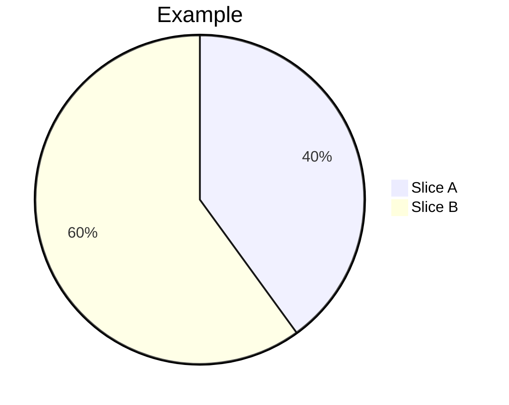

# Charts

Mermaid diagrams for visual planning. Each file contains one or more related charts in fenced `mermaid` code blocks.

## Purpose

- Visualise costs, timelines, and architecture at a glance
- Charts are created here during planning, then merged into wiki pages (`src/`) by the Wiki Editor when notes are promoted
- The Planner agent creates charts here alongside relevant planning work

## Format

Each `.md` file contains Mermaid fenced code blocks:

````markdown

````

## Naming

- Descriptive slug: `<topic>-<chart-type>.md` (e.g. `server-costs-pie.md`, `career-gantt.md`)
- One file can hold multiple related charts (e.g. all cost breakdowns together)

## Linking

Charts should be linked from the relevant note or checklist. When the Wiki Editor promotes content to `src/`, it inlines the Mermaid block directly into the wiki page.
