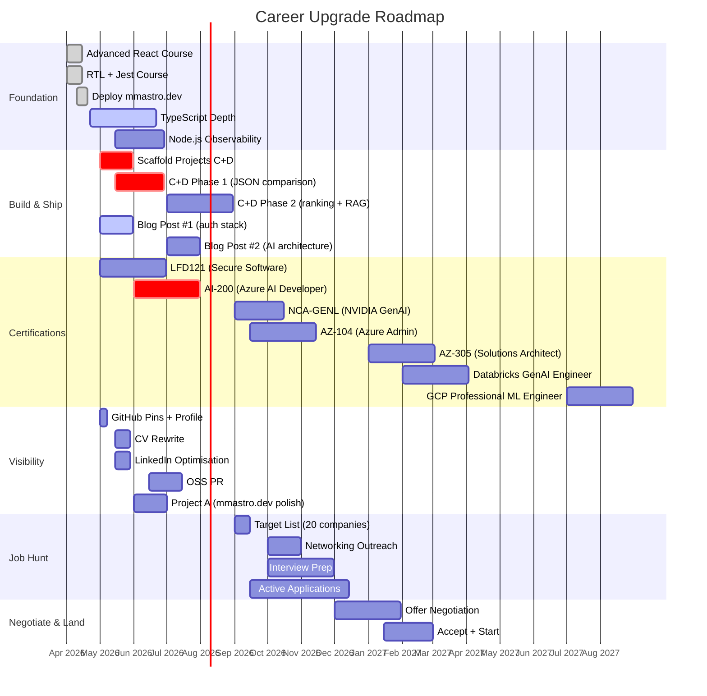
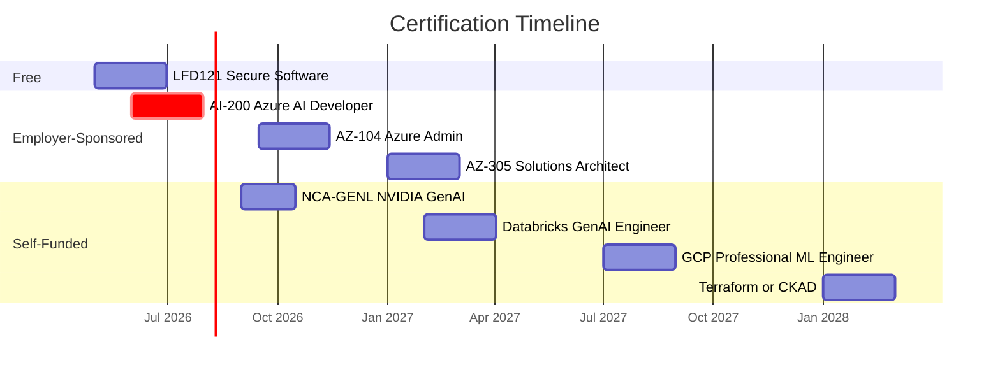

# Career Path Timeline

Gantt chart visualizing the career roadmap phases. Data sourced from [notes/career-plan.md](../career-plan.md).

> Linked from: [notes/career-plan.md](../career-plan.md), [notes/checklists/career-immediate-actions.md](../checklists/career-immediate-actions.md)

---

## Full Roadmap (April 2026 – March 2027)

---

## Certification Sequence

