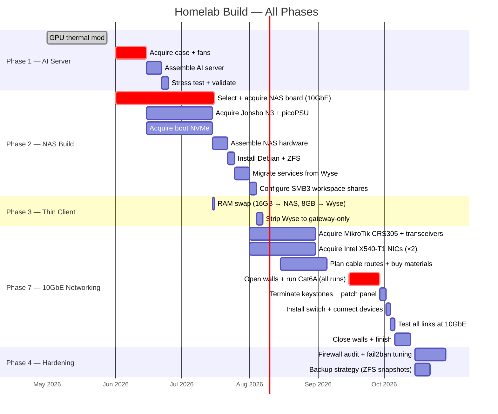
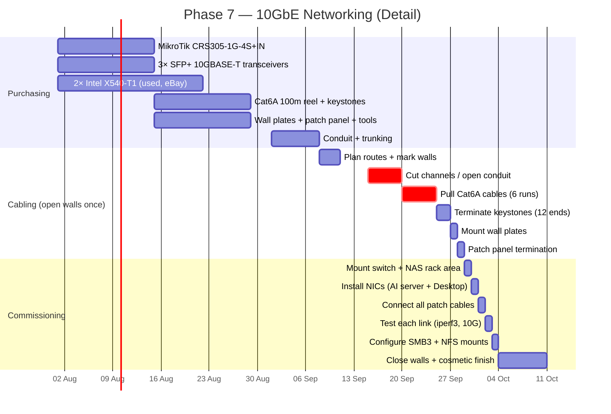

# Homelab Build Timeline

Gantt chart for the full homelab build across all phases. Data sourced from [notes/deployment-checklist.md](../deployment-checklist.md).

> Linked from: [notes/deployment-checklist.md](../deployment-checklist.md), [notes/checklists/shopping-parts.md](../checklists/shopping-parts.md)

---

## Full Build Roadmap

---

## 10GbE Networking Phase — Detailed

