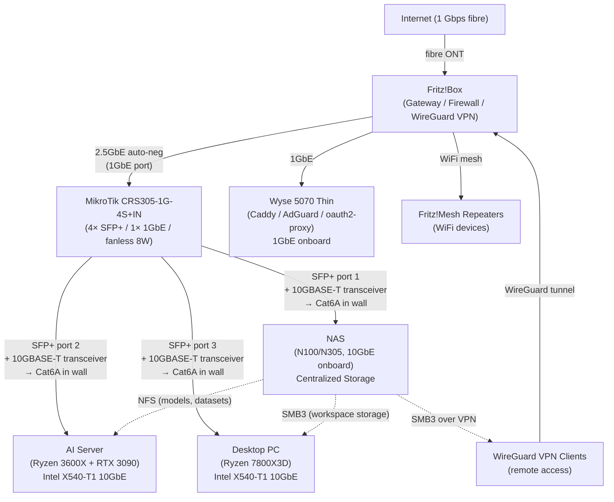
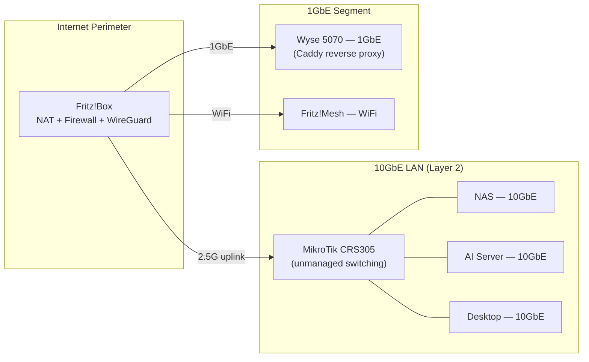
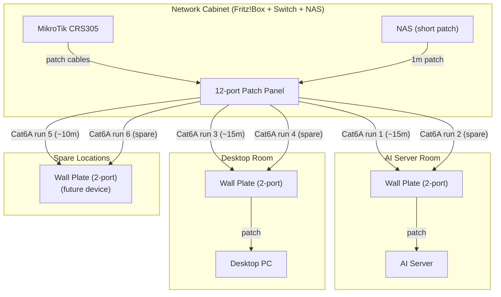

# 10GbE LAN Network Topology

Planned network structure after the 10GbE upgrade. Data sourced from [notes/shopping-list.md](../shopping-list.md).

> Linked from: [notes/shopping-list.md](../shopping-list.md), [notes/checklists/homelab-phase-7-10gbe-networking.md](../checklists/homelab-phase-7-10gbe-networking.md)

---

## Network Topology (Planned)

---

## Layer Breakdown

---

## Cabling Plan (Cat6A Structured — "Open Walls Once")

