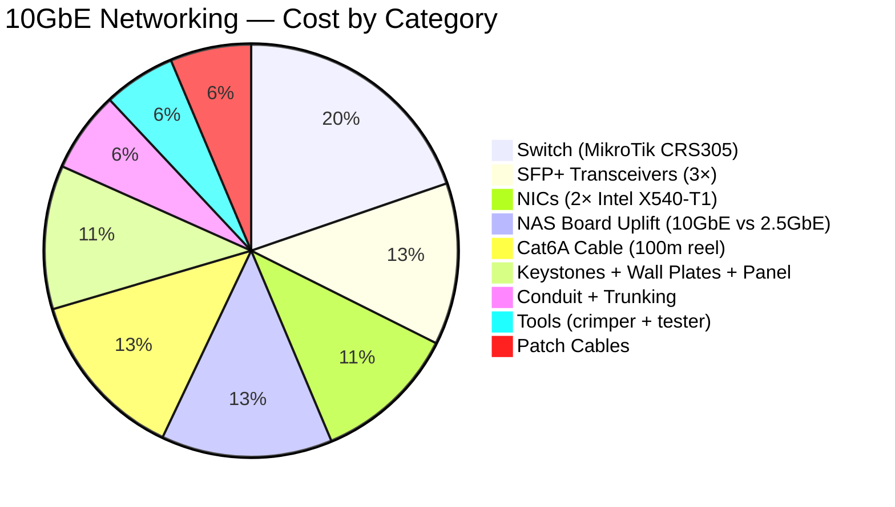
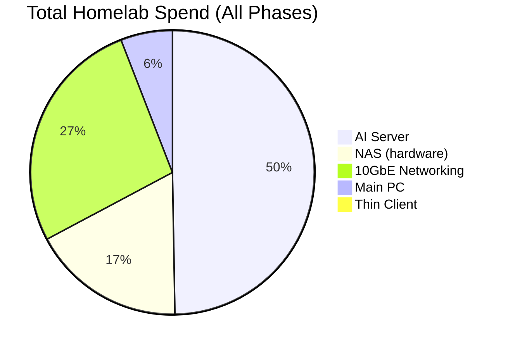
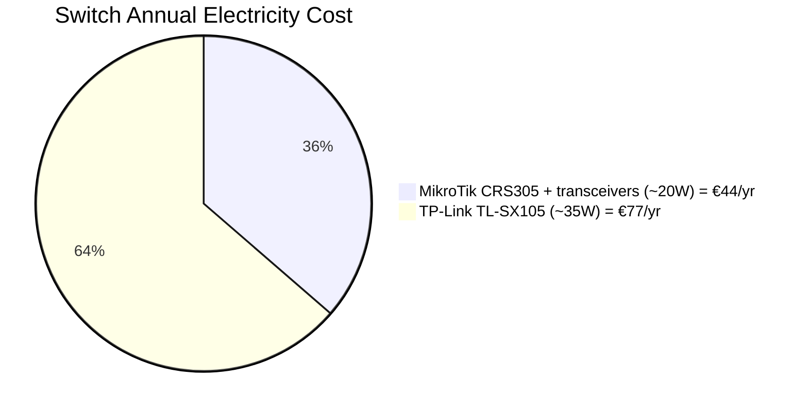

# 10GbE Networking Costs

Cost breakdown for the 10GbE LAN upgrade. Data sourced from [notes/shopping-list.md](../shopping-list.md).

> Linked from: [notes/shopping-list.md](../shopping-list.md), [notes/checklists/homelab-phase-7-10gbe-networking.md](../checklists/homelab-phase-7-10gbe-networking.md)

---

## Total Networking Cost by Category

Total estimated: ~€620-845. Midpoint used for chart (~€730).

---

## Networking vs Other Homelab Spend

Shows the 10GbE upgrade in context of total homelab spending.

---

## Power Consumption Comparison (24/7 Operation)

Annual electricity cost at €0.25/kWh for two switch options considered.

MikroTik saves ~€33/year in electricity. Transceivers (~€90) pay for themselves in ~3 years vs the TP-Link's higher power draw. Combined with fanless silence, MikroTik is the clear choice for 24/7 homelab.
