# Homelab Project Costs

Consolidated cost and power charts for the full homelab infrastructure. Data sourced from [notes/shopping-list.md](../shopping-list.md).

> Replaces: `server-costs-pie.md` (server-only) and `networking-costs-pie.md` (networking-only).
> Linked from: [notes/shopping-list.md](../shopping-list.md), [notes/deployment-checklist.md](../deployment-checklist.md)

---

## Grand Total Overview

Total homelab investment: **~€2,700** (midpoint of €2,436–2,966 range).

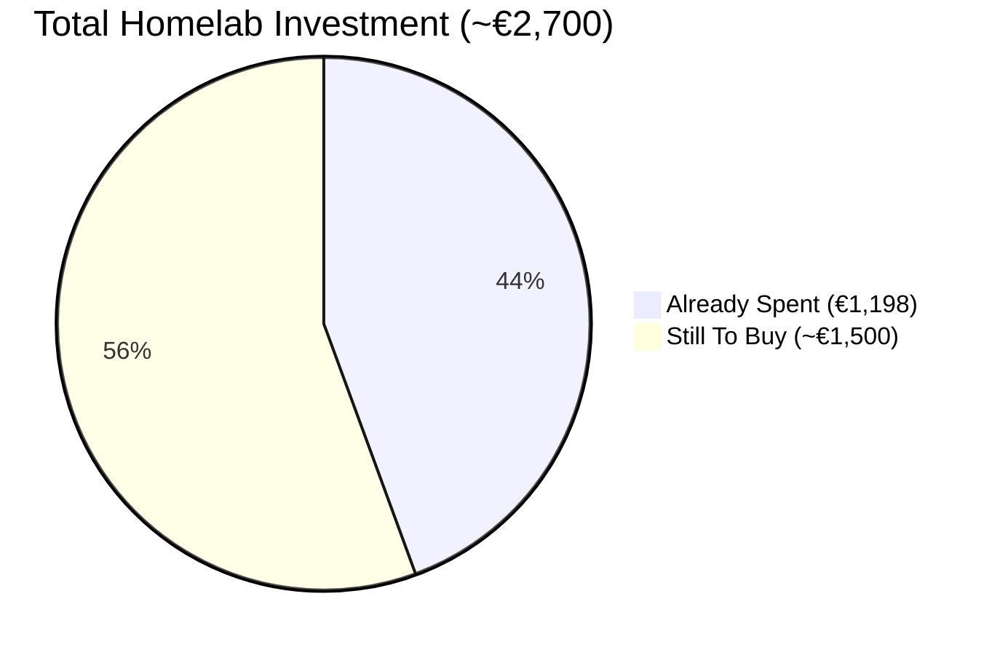

---

## Cost Share by Project

How the total budget divides across the four build projects.

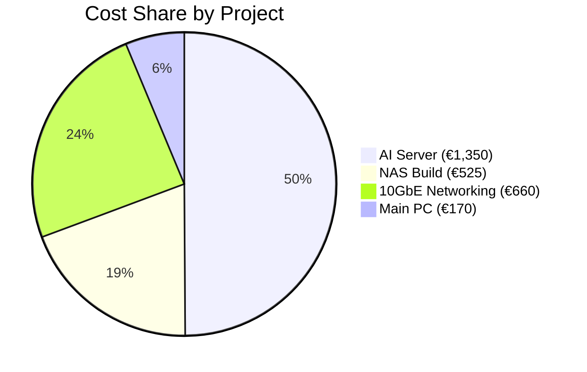

> Thin Client omitted (€0 new spend). NAS includes 10GbE board cost; networking covers switch, NICs, cabling only (no double-counting).

---

## AI Server — Component Breakdown

Total build: ~€1,350. Already spent: €1,198. Remaining: ~€150.

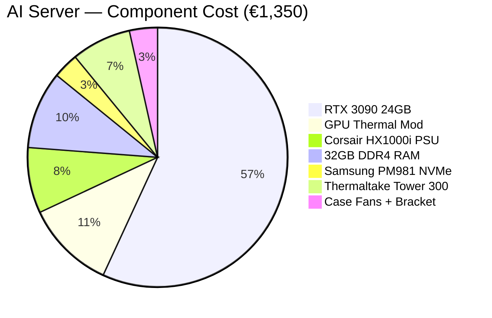

> Owned components (Ryzen 3600X ~€80, B450M-A PRO MAX ~€50) not shown — zero new spend.

---

## NAS — Component Breakdown

Total build: ~€525 (midpoint). All to buy.

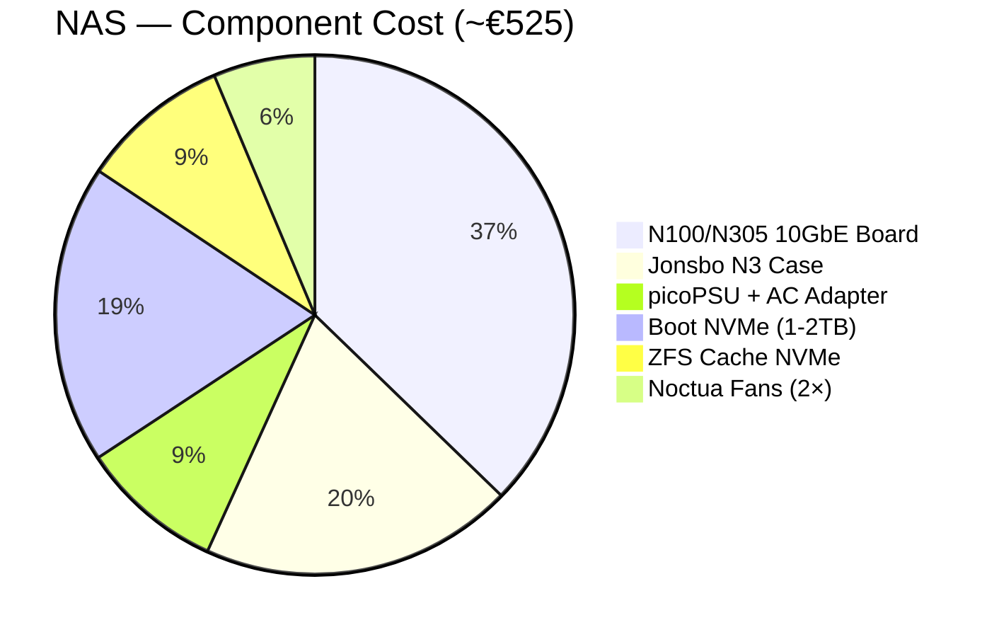

> Owned components (16GB DDR4 from Wyse, 3× WD Red 4TB, 2× WD Black 2TB) not shown — zero new spend.

---

## 10GbE Networking — Component Breakdown

Total: ~€660 (midpoint of €550–765).

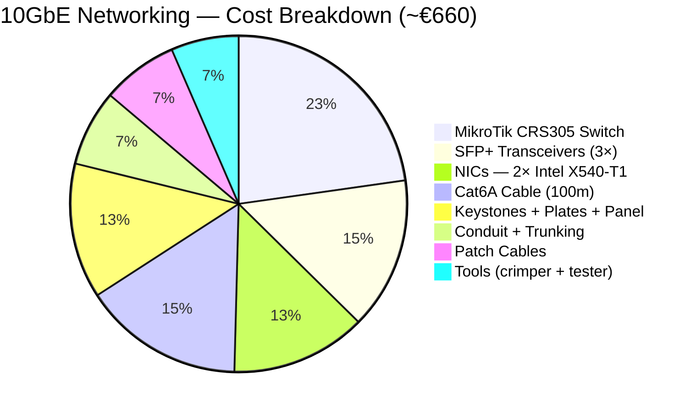

---

## Main PC — Remaining Spend

Minimal investment. Only case decision pending.

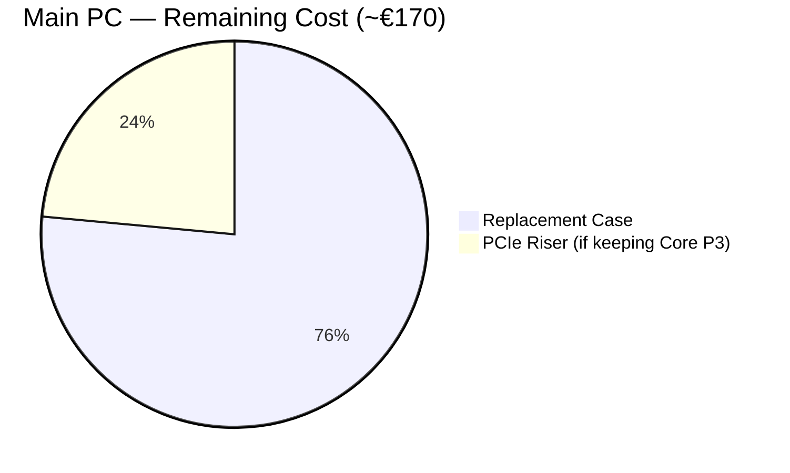

> One of these is purchased, not both — depends on case decision. Shown for proportion.

---

## Power Consumption — Sustained Load (All 24/7 Devices)

Total 24/7 draw at typical sustained load: ~**165W**.

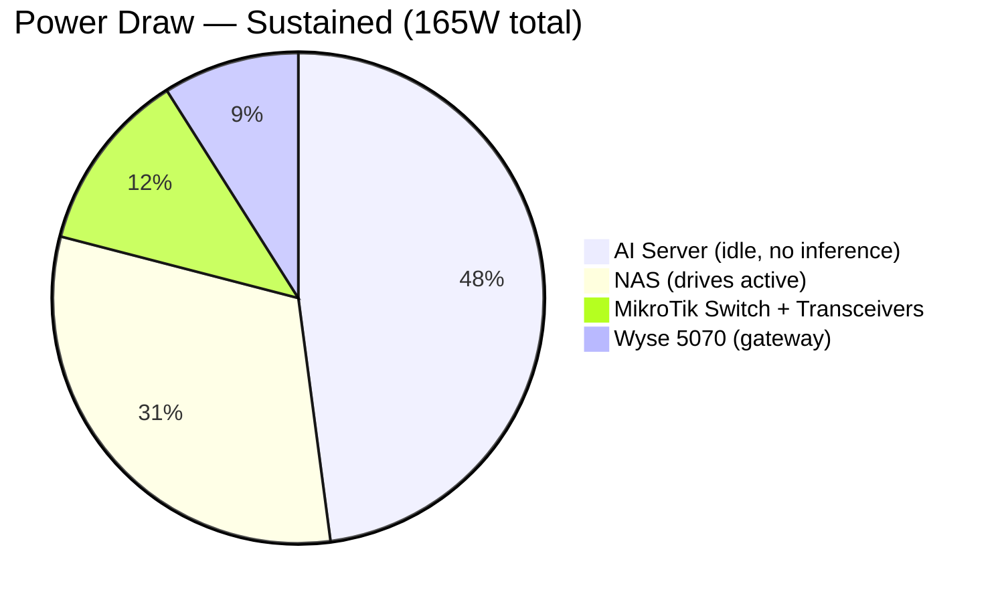

> AI Server at idle (no inference running). During inference bursts the 3090 adds 150–320W (total system 230–400W), but these are intermittent. Main PC not shown (not 24/7).

---

## Power Consumption — Full Load (Peak)

Maximum draw when all systems are active simultaneously: ~**485W**.

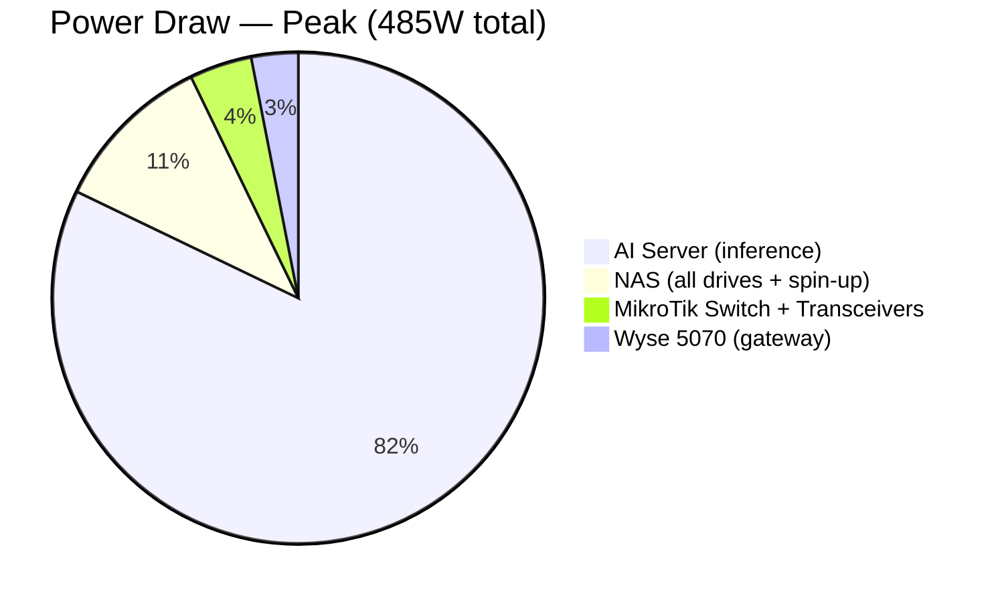

---

## Annual Electricity Cost (24/7, €0.25/kWh)

Based on typical average load profiles (NAS ~35W avg with drive spindown, AI server ~100W avg with periodic inference, others constant).

| System | Avg Draw | Annual kWh | Annual Cost |
|---|---:|---:|---:|
| AI Server (avg with inference) | ~100W | 876 kWh | ~€219 |
| NAS (avg with spindown) | ~35W | 307 kWh | ~€77 |
| MikroTik + transceivers | ~20W | 175 kWh | ~€44 |
| Wyse 5070 | ~15W | 131 kWh | ~€33 |
| **Total** | **~170W** | **1,489 kWh** | **~€373/year** |

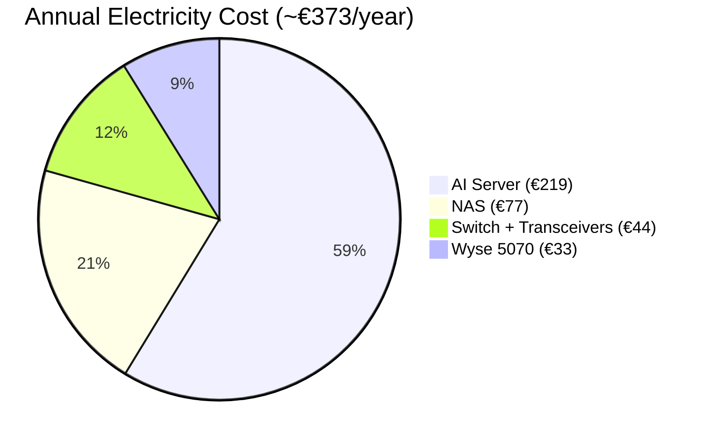

---

## Switch Power Comparison (Decision Context)

Why MikroTik CRS305 was chosen over TP-Link TL-SX105.

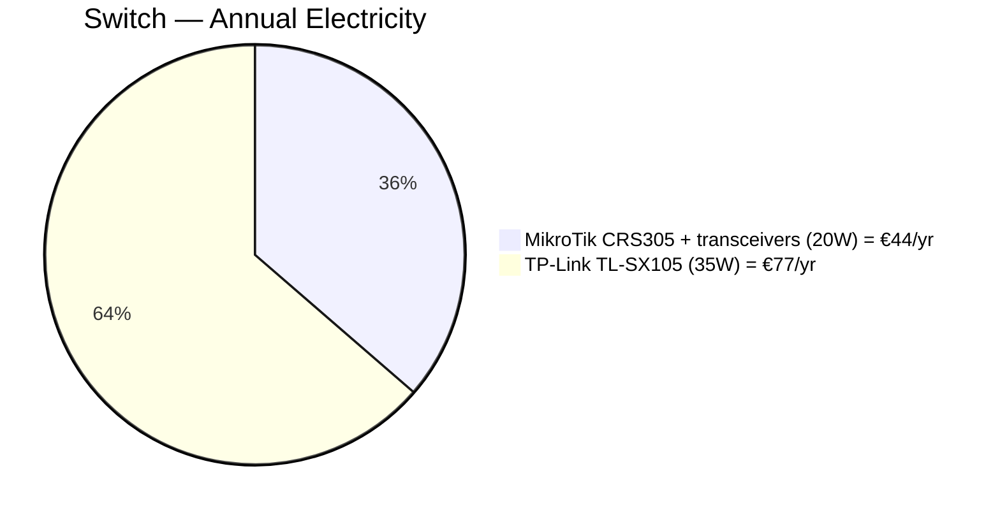

MikroTik saves €33/year. Transceiver cost (€90) pays back in ~3 years. Plus: fanless = silent 24/7 operation.

---

## ROI Analysis

### Cloud Storage Savings (NAS vs Google One / B2)

| Scenario | Cloud Cost/Year | NAS Cost (hardware + electricity) | Breakeven |
|---|---:|---:|---:|
| Google One 2TB (current) | €100/year | €525 + €77/yr | ~7.5 years |
| Google One 2TB + iCloud (photo backup redundancy) | €200/year | €525 + €77/yr | ~4.3 years |
| Realistic 5TB+ (year 3+, Backblaze B2 / enterprise) | €300+/year | €525 + €77/yr | ~2.4 years |

**Key insight:** at ~2TB+/year data growth (RAW photos, video, datasets), consumer cloud tiers become insufficient within 2 years. The NAS provides 13TB usable (RAIDZ1) today with expansion to 20TB+ (full 8 bays). Cloud storage at that scale costs €400-600/year. The NAS breaks even in **~1.5-2.5 years** at realistic growth.

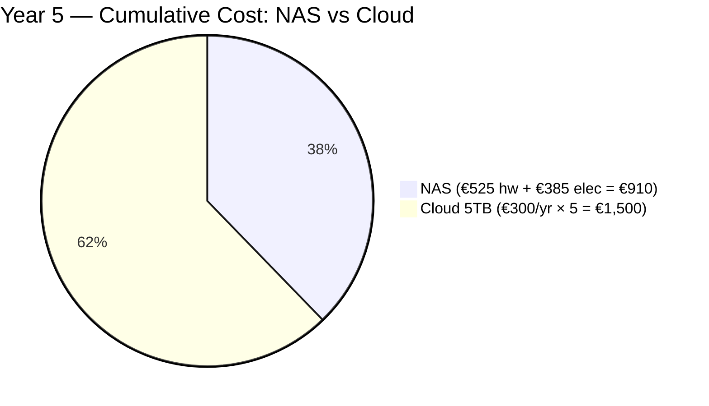

**5-year savings vs cloud:** ~€590 (conservative) to ~€2,000+ (heavy usage / enterprise tier).

Additional value not priced:
- Full data sovereignty (no vendor lock-in, no ToS changes)
- ZFS snapshots (instant rollback, no extra cost)
- No upload bandwidth dependency for access
- Serves Immich, Paperless, Memos without separate hosting fees

---

### AI Services Savings (Self-hosted vs Cloud API)

Based on existing analysis in [notes/ai-server.md](../ai-server.md):

| Service | Cloud Cost/Year | Self-hosted Equivalent |
|---|---:|---|
| Claude Pro subscription | €240/year | Qwen2.5 14B (local, unlimited) |
| API usage (light, ~€15/month) | €180/year | Ollama inference (local, unlimited) |
| **Total cloud AI avoided** | **€420/year** | RTX 3090 + electricity |

| Metric | Value |
|---|---|
| AI server hardware cost | €1,350 |
| AI server electricity (5 years) | €1,095 (€219/yr) |
| **5-year TCO (self-hosted)** | **€2,445** |
| **5-year cloud cost (at €420/yr)** | **€2,100** |
| **Breakeven** | **~5.8 years** |

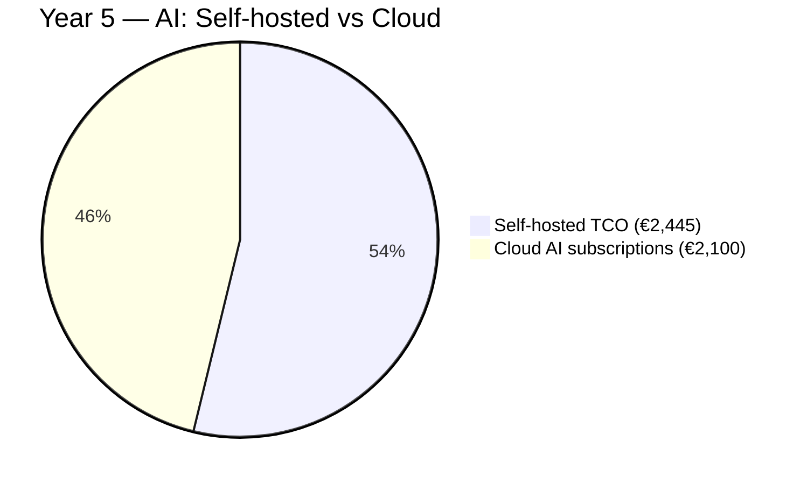

**At current usage, AI self-hosting breaks even at ~5.8 years.** However:
- Heavier inference (3,000+ req/month, Claude Sonnet tier): breakeven drops to **~2-3 years**
- No rate limits, no content policies, full privacy
- Fine-tuning capability (impossible on consumer cloud tiers)
- Portfolio/CV value of running inference infrastructure
- Hardware retains ~30-40% resale value after 5 years (~€400-500)

---

### 10GbE Cabling — Property & Functional Value

Structured Cat6A cabling is a permanent infrastructure improvement to the property.

| Value Category | Estimated Impact |
|---|---|
| Property resale premium (Cat6A structured cabling in apartment) | +€1,500-3,000 |
| Eliminated need for large local storage on each device | Saves ~€200-400 in NVMe upgrades across 3 devices |
| Eliminated USB-attached storage (external HDDs) | Saves ~€100-200 in enclosures/docks |
| Reduced data fragmentation (single source of truth) | Qualitative: no sync conflicts, no stale copies |
| Future-proofing (supports 10GbE for 15-20 years minimum) | Avoids re-cabling cost (~€800-1,200 labour if done later) |

**Cabling investment: ~€260-395.** Against property value alone (+€1,500-3,000), ROI is immediate. Against avoided re-cabling labour, ROI is also immediate if you ever need to upgrade later.

"Open walls once" approach saves ~€800-1,200 in future labour costs vs doing it incrementally.

---

### Combined ROI Summary (5-Year Horizon)

| Category | 5-Year Investment | 5-Year Savings/Value | Net Position |
|---|---:|---:|---:|
| NAS vs cloud storage | €910 | €1,500-2,500 | **+€590 to +€1,590** |
| AI server vs cloud API | €2,445 | €2,100-3,600 | **-€345 to +€1,155** |
| 10GbE cabling vs property value | €660 | €1,500-3,000 (property) | **+€840 to +€2,340** |
| **Total** | **€4,015** | **€5,100-9,100** | **+€1,085 to +€5,085** |

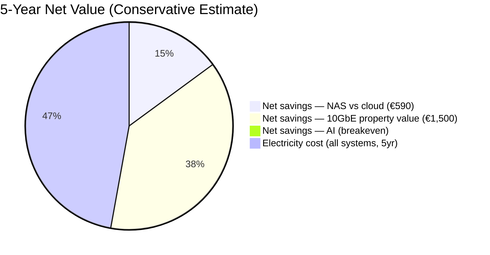

**Conservative 5-year outcome:** entire homelab investment pays for itself through cloud savings + property value, with AI infrastructure at breakeven. At heavier usage, the whole system is **€3,000-5,000 net positive** over 5 years vs equivalent cloud services + no cabling.
