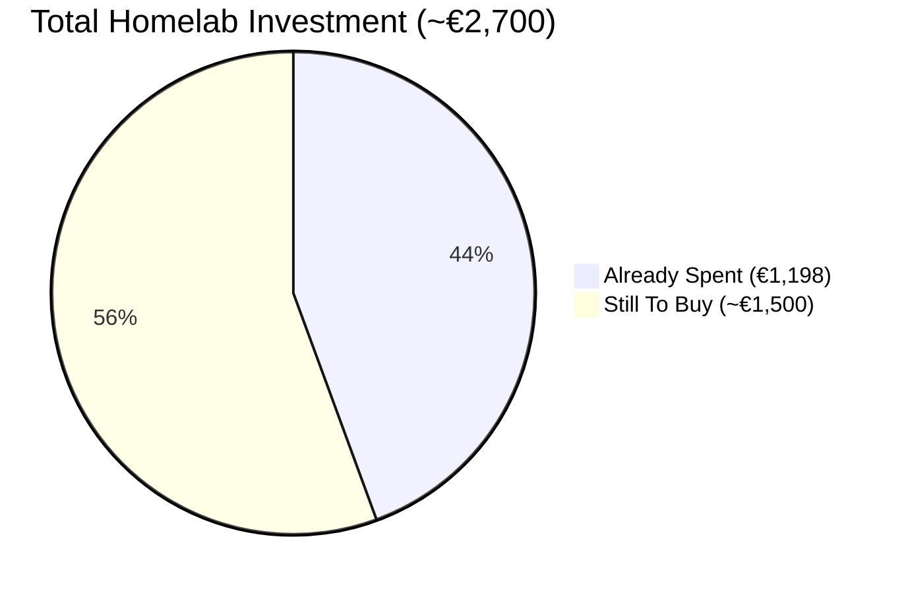
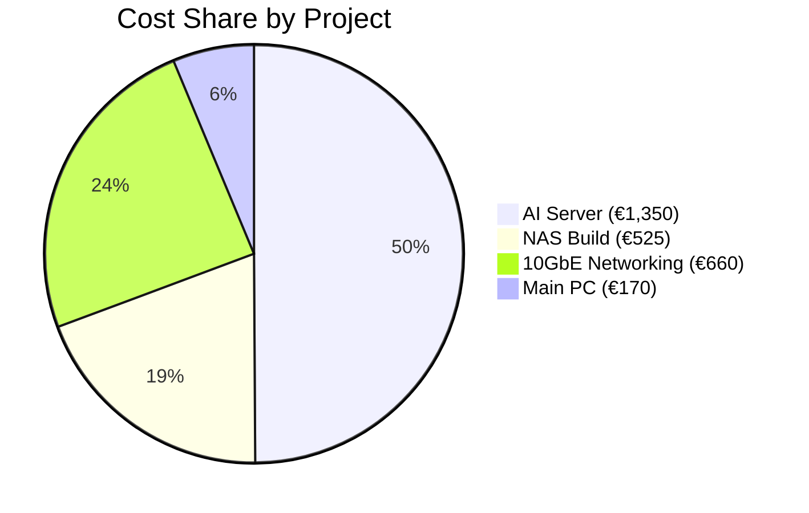
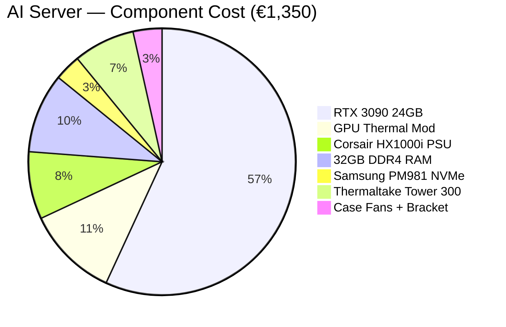
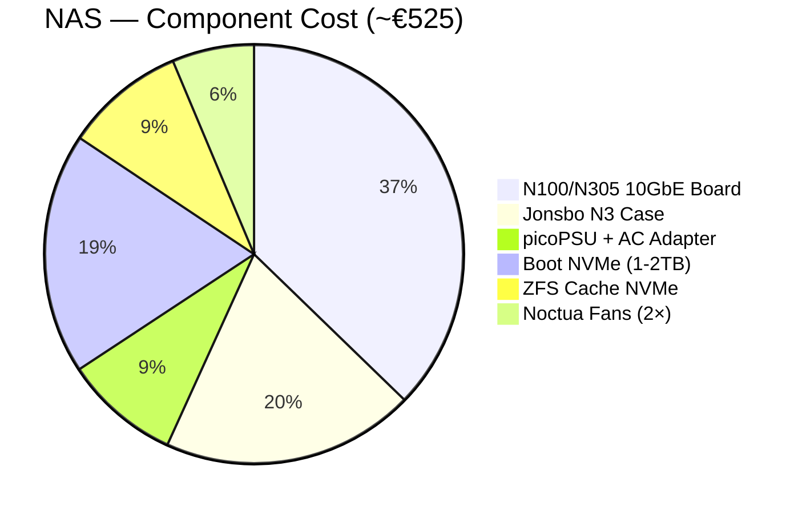
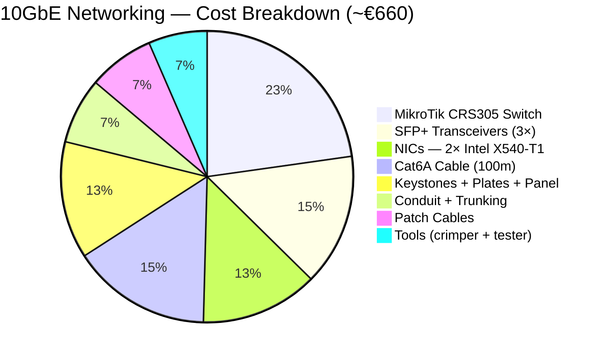
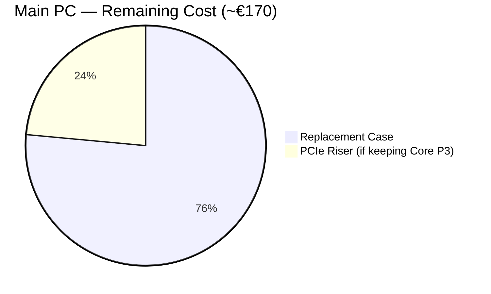
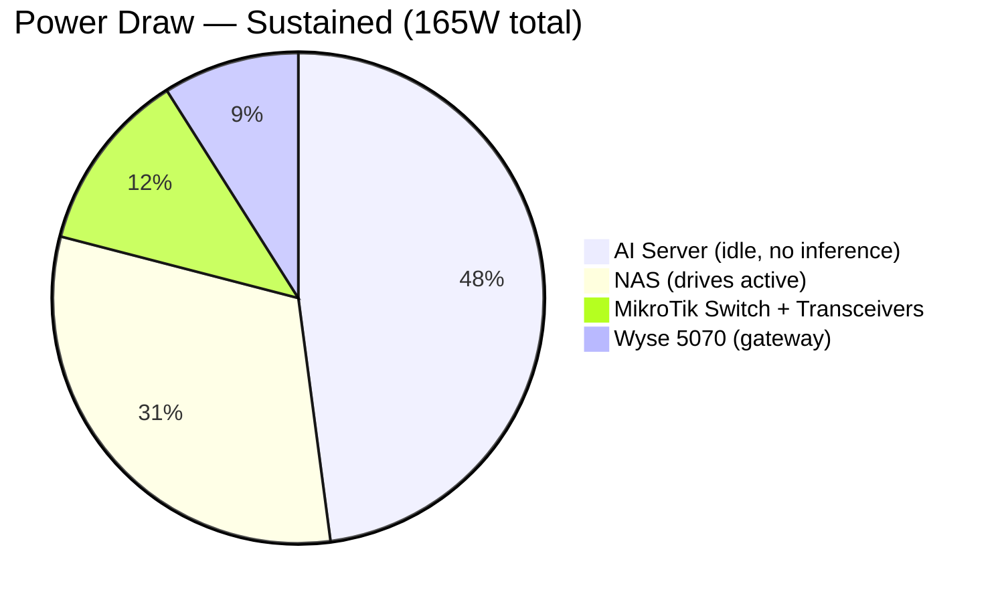
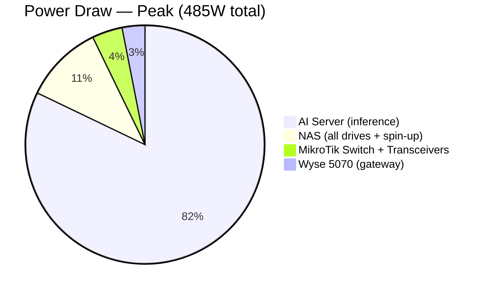
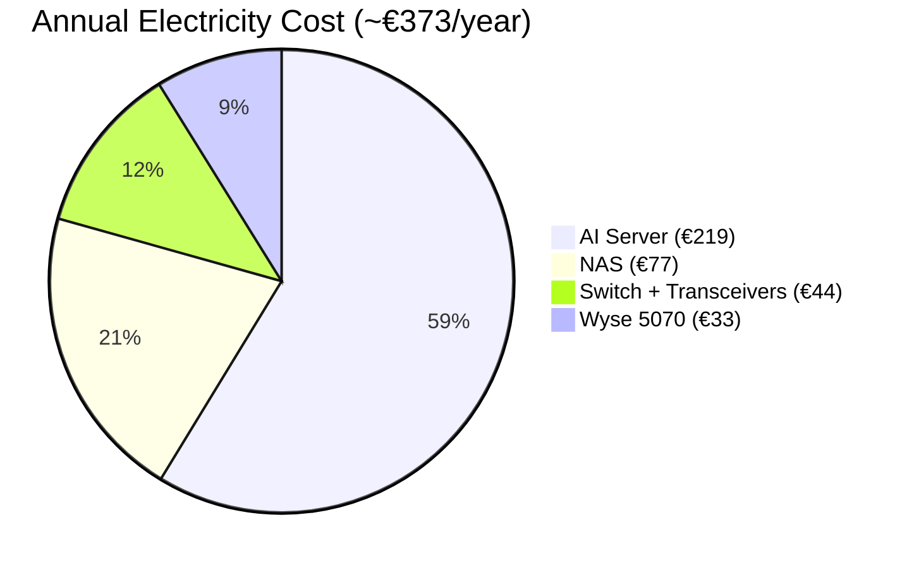
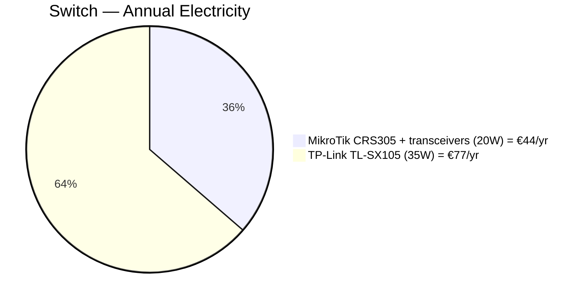

# Homelab Project Costs

Consolidated cost and power charts for the full homelab infrastructure. Data sourced from [notes/shopping-list.md](../shopping-list.md).

> Replaces: `server-costs-pie.md` (server-only) and `networking-costs-pie.md` (networking-only).
> Linked from: [notes/shopping-list.md](../shopping-list.md), [notes/deployment-checklist.md](../deployment-checklist.md)

---

## Grand Total Overview

Total homelab investment: **~€2,700** (midpoint of €2,436–2,966 range).

---

## Cost Share by Project

How the total budget divides across the four build projects.

> Thin Client omitted (€0 new spend). NAS includes 10GbE board cost; networking covers switch, NICs, cabling only (no double-counting).

---

## AI Server — Component Breakdown

Total build: ~€1,350. Already spent: €1,198. Remaining: ~€150.

> Owned components (Ryzen 3600X ~€80, B450M-A PRO MAX ~€50) not shown — zero new spend.

---

## NAS — Component Breakdown

Total build: ~€525 (midpoint). All to buy.

> Owned components (16GB DDR4 from Wyse, 3× WD Red 4TB, 2× WD Black 2TB) not shown — zero new spend.

---

## 10GbE Networking — Component Breakdown

Total: ~€660 (midpoint of €550–765).

---

## Main PC — Remaining Spend

Minimal investment. Only case decision pending.

> One of these is purchased, not both — depends on case decision. Shown for proportion.

---

## Power Consumption — Sustained Load (All 24/7 Devices)

Total 24/7 draw at typical sustained load: ~**165W**.

> AI Server at idle (no inference running). During inference bursts the 3090 adds 150–320W (total system 230–400W), but these are intermittent. Main PC not shown (not 24/7).

---

## Power Consumption — Full Load (Peak)

Maximum draw when all systems are active simultaneously: ~**485W**.

---

## Annual Electricity Cost (24/7, €0.25/kWh)

Based on typical average load profiles (NAS ~35W avg with drive spindown, AI server ~100W avg with periodic inference, others constant).

| System | Avg Draw | Annual kWh | Annual Cost |
|---|---:|---:|---:|
| AI Server (avg with inference) | ~100W | 876 kWh | ~€219 |
| NAS (avg with spindown) | ~35W | 307 kWh | ~€77 |
| MikroTik + transceivers | ~20W | 175 kWh | ~€44 |
| Wyse 5070 | ~15W | 131 kWh | ~€33 |
| **Total** | **~170W** | **1,489 kWh** | **~€373/year** |

---

## Switch Power Comparison (Decision Context)

Why MikroTik CRS305 was chosen over TP-Link TL-SX105.

MikroTik saves €33/year. Transceiver cost (€90) pays back in ~3 years. Plus: fanless = silent 24/7 operation.
