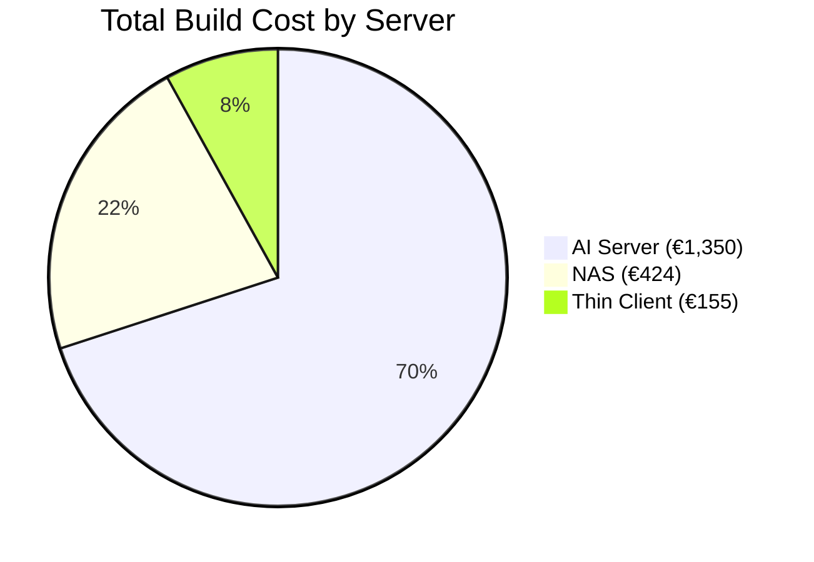
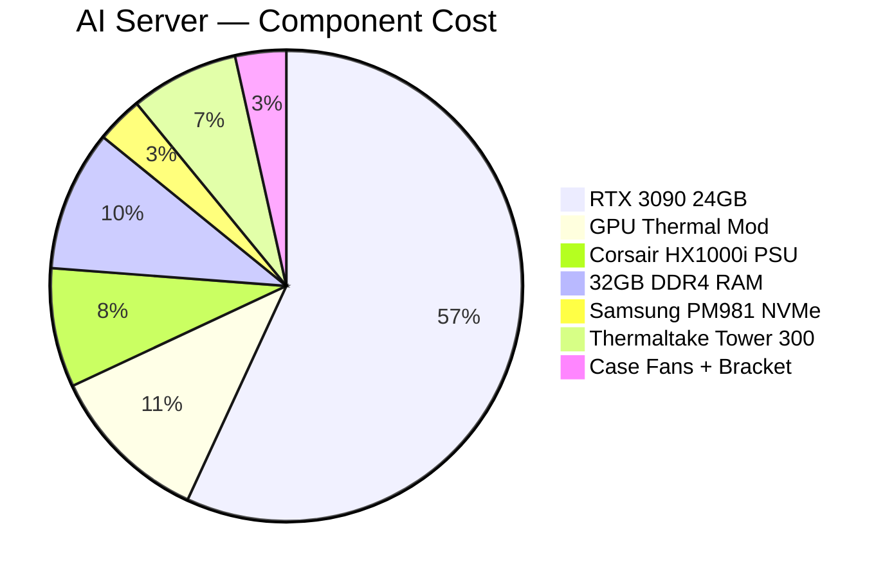
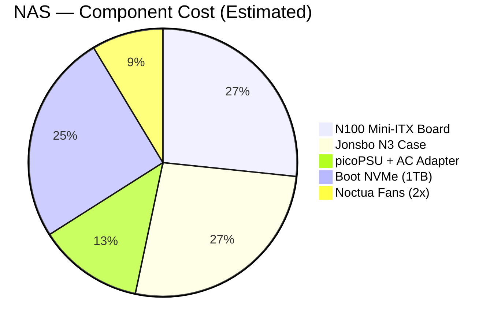
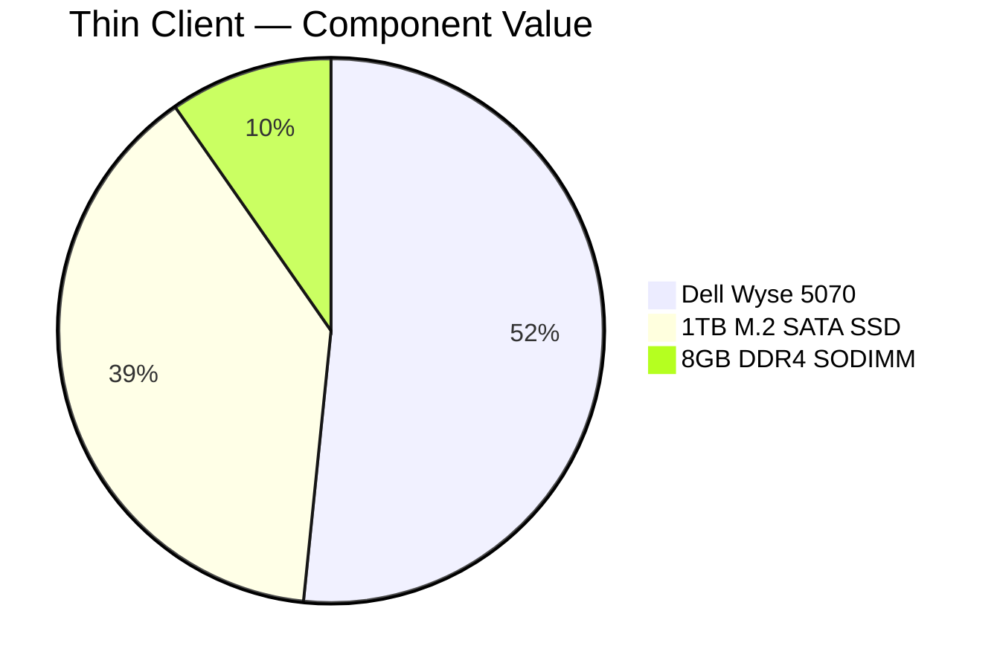
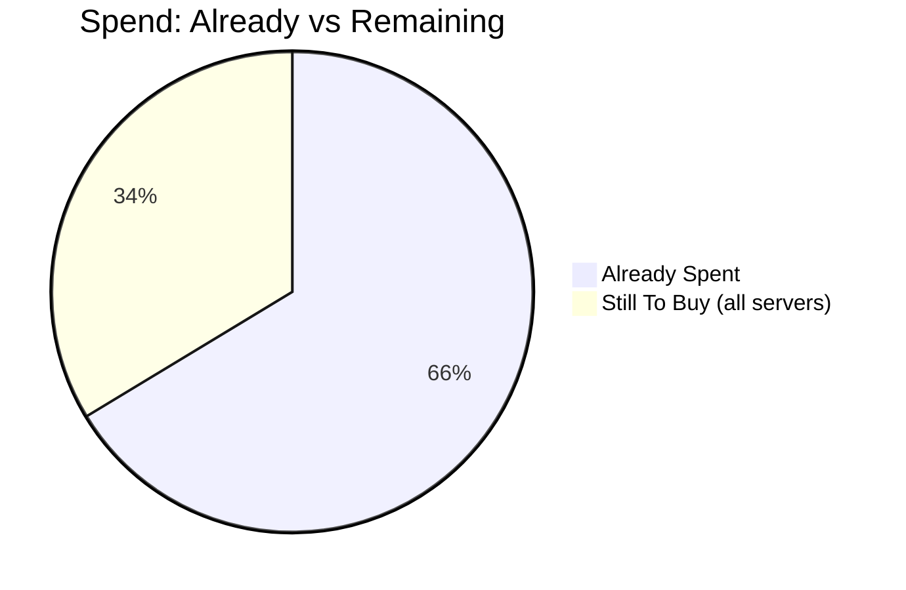

# Server Infrastructure Costs

Cost breakdown charts for the 3-server homelab. Data sourced from [notes/shopping-list.md](../shopping-list.md).

> Linked from: [notes/shopping-list.md](../shopping-list.md), [notes/infrastructure.md](../infrastructure.md)

---

## Total Cost by Server

Compares total build cost (spent + to-buy) across all three servers. Thin client uses existing hardware only (€0 new spend), so system value (€155) is shown for proportion.

---

## AI Server Component Breakdown

Total build cost: ~€1,350. Dominated by the RTX 3090.

> Owned components (Ryzen 3600X ~€80, B450M-A PRO MAX ~€50) not shown — zero new spend.

---

## NAS Component Breakdown

Estimated total build cost: ~€424 (midpoint of €312–536 range). All components are to-buy.

> Owned components (16GB DDR4 from Wyse, 3x WD Red 4TB, 2x WD Black 2TB) not shown — zero new spend.

---

## Thin Client Component Breakdown

Zero new spend. All components are pre-owned. Shown by projected value.

---

## Spend Timeline

Cumulative new spend as hardware is acquired.

