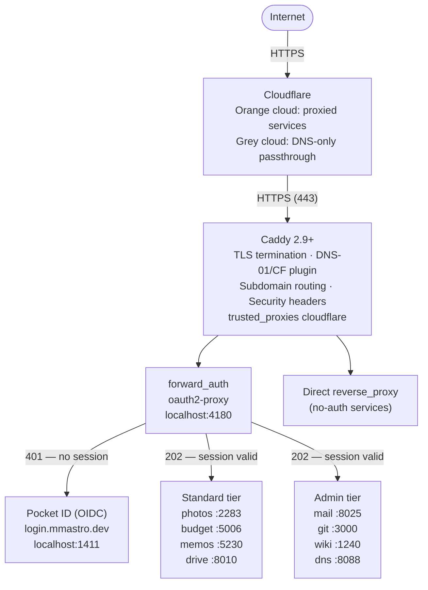
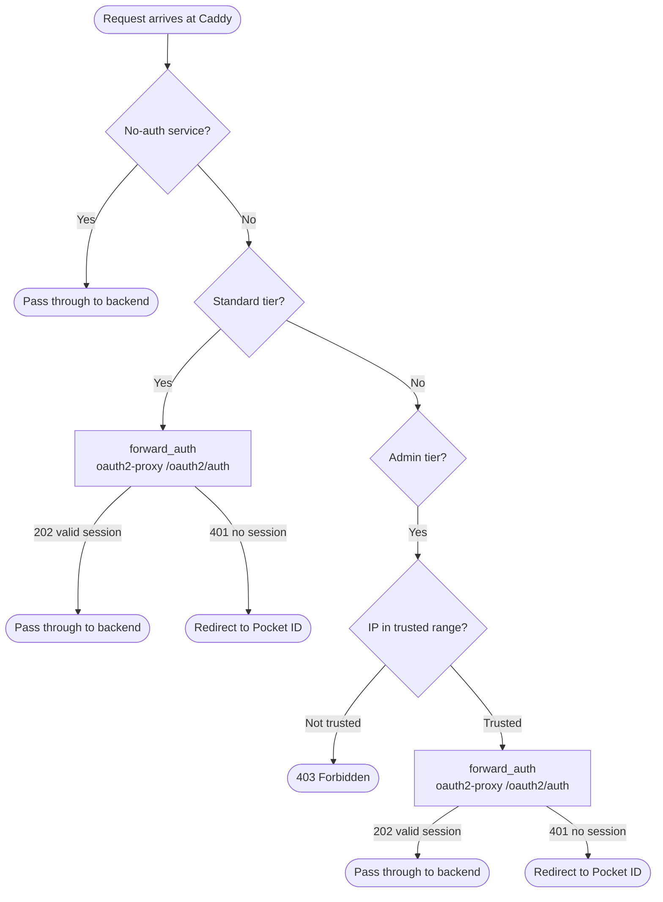
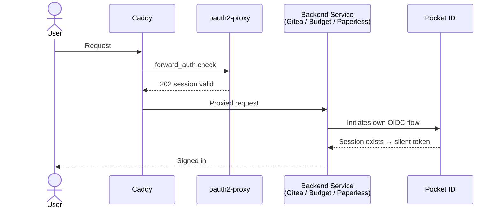

# Architecture Overview

## System Diagram

## Component Roles

| Component | Role |
|---|---|
| **Cloudflare** | DNS, CDN, edge TLS (orange cloud), DDoS protection |
| **Caddy** | Reverse proxy, TLS termination, auth gate via `forward_auth`, security headers |
| **oauth2-proxy** | OIDC session management, cookie issuance, auth check endpoint (`/oauth2/auth`) |
| **Pocket ID** | OIDC identity provider (passkey-only), issues tokens to oauth2-proxy and native OIDC services |
| **AdGuard Home** | Local DNS resolver with split-DNS rewrites, forces LAN clients to resolve `*.mmastro.dev` to the server's LAN IP |

## Auth Gate Flow

## Data Flow for Native OIDC Services

Some services (Gitea, Actual Budget, Paperless-ngx) maintain their own OIDC sessions with Pocket ID. When a valid oauth2-proxy session exists, Pocket ID recognises it and silently returns a token — the user sees a single login, not two.

